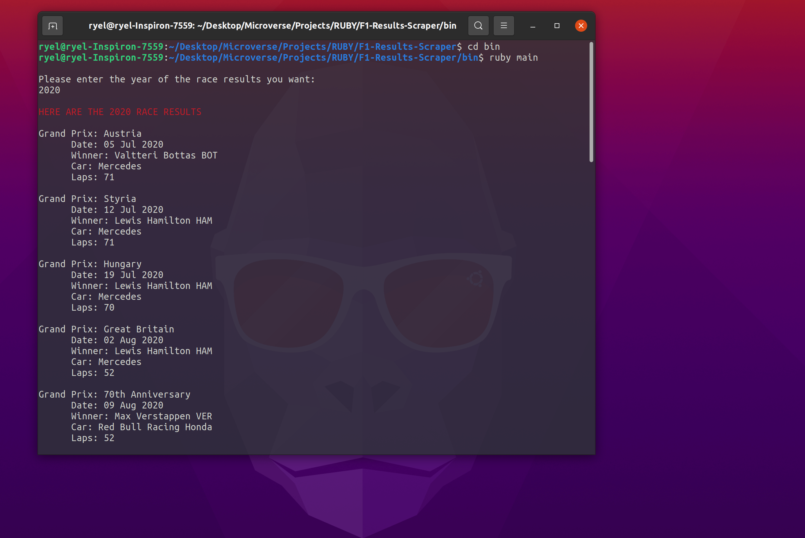

# F1-Results-Scraper

> This scraper returns the race results for any Formula 1 season that you choose.

Additional description about the project and its features.

## Getting Started

To get a local copy up and running follow these simple steps.

### Prerequisites
- You need to have [Ruby](https://www.ruby-lang.org/en/) installed.

### Setup
- Download or clone this repo.
- From your terminal, `cd` into the `F1-Results-Scraper` directory and run `bundle install`

### Usage
- To run, `cd` into `F1-Results-Scraper/bin` and run `main.rb`
- Enter a year to get the Formula 1 race results of that season.
## Authors

👤 **Ryel Banfield**

- GitHub: [@RyelBanfield](https://github.com/RyelBanfield)
- Twitter: [@RyelBanfield](https://twitter.com/RyelBanfield)
- LinkedIn: [RyelBanfield](https://www.linkedin.com/in/ryel-banfield/)

## 🤝 Contributing

Contributions, issues, and feature requests are welcome!

Feel free to check the [issues page](issues/).

## Show your support

Give a ⭐️ if you like this project!

## 📝 License

This project is [MIT](LICENSE) licensed.
